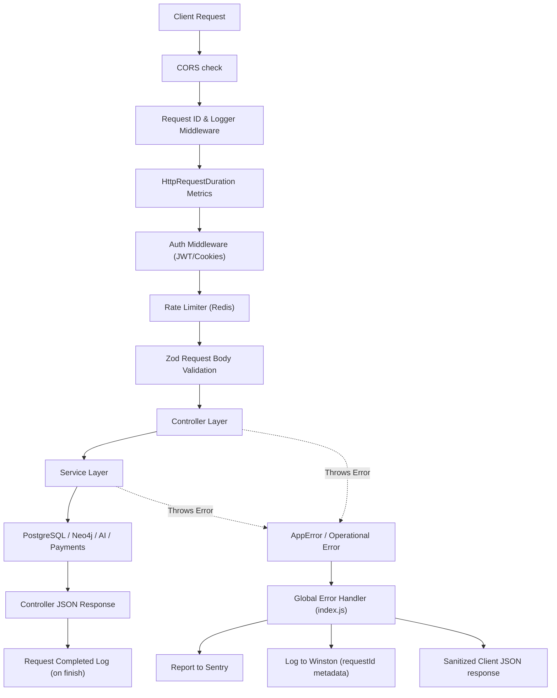

# GraphCareers Backend: Architecture & Agent Guidelines

This document serves as the single source of truth for the architecture, design patterns, coding conventions, and operational workflows of the GraphCareers backend repository. It is designed to guide future engineers and AI coding agents on how to construct, modify, and maintain code in this project without introducing regressions.

---

## 🎯 1. Project Overview

**GraphCareers** is an AI-powered job matching and career progression platform. The backend is a high-performance HTTP service responsible for:
- User profile and authentication management.
- Dynamic career progression tracking and matching.
- Asynchronous AI extraction of resume content (PDFs/DOCXs).
- Processing payment checkouts and billing events (Pro-tier access).
- Querying complex path relations between skills and jobs in a Graph Database.
- Continuous metric capture, error logging, and performance auditing.

---

## 💻 2. Tech Stack

The backend uses a modern, light-footprint Node.js stack with strict ES Module compilation:

- **Runtime**: Node.js v20 (Dockerized on Alpine Linux)
- **Framework**: Express.js (v5)
- **Database (Relational)**: PostgreSQL via Drizzle ORM
- **Database (Graph)**: Neo4j (via `neo4j-driver`)
- **Caching & Queue Storage**: Redis (via `ioredis`)
- **Queue Engine**: BullMQ (v5)
- **AI Integrations**: Vercel AI SDK (with OpenRouter/OpenAI provider)
- **Validation**: Zod (for request validation)
- **Error Tracking**: Sentry (Node.js SDK)
- **Logging**: Winston Structured Logger
- **Metrics**: Prometheus & Grafana (via `/metrics` endpoint)
- **Payment Gateway**: Razorpay Node SDK

---

## 📂 3. Folder Structure

The code is organized into a modular structure mimicking the Controller-Service-Repository pattern. Here is the canonical tree:

```
D:/GraphCareers/backend/
├── .agents/
│   └── AGENTS.md                   <-- This file (Workspace Customizations Root)
├── monitoring/                     <-- Prometheus, Loki, and Promtail configs
├── uploads/                        <-- Shared ephemeral volume for uploads
├── src/
│   ├── config/                     <-- Environment variables & global client setup
│   ├── controllers/                <-- Express route request handlers
│   ├── db/                         <-- DB definitions, pool configuration, & schemas
│   │   ├── neo4j/                  <-- Neo4j session and driver wrappers
│   │   ├── cleanerQueue.js
│   │   ├── index.js
│   │   └── schema.js               <-- PostgreSQL schema definition
│   ├── lib/                        <-- Custom libraries, integrations, and wrappers
│   ├── logger/                     <-- Winston logger proxy implementation
│   ├── middleware/                 <-- Route validation, auth, rate limiters
│   ├── queue/                      <-- BullMQ queue initializations
│   ├── routes/                     <-- Express route mappings
│   ├── schemas/                    <-- Zod validation schemas
│   ├── scripts/                    <-- Dev utilities and seed scripts
│   ├── services/                   <-- Central core business logic
│   ├── workers/                    <-- BullMQ worker execution handlers
│   └── index.js                    <-- Server bootstrap entrypoint
├── Dockerfile                      <-- Single image building specifications
├── docker-compose.yml              <-- Multi-container staging config
└── package.json                    <-- Runtime scripts & ESM dependencies list
```

---

## 🔄 4. Request Lifecycle

Every HTTP request undergoes a strict sequential pipeline from connection to response.



### Request Pipeline Stages:
1. **CORS / Core Configuration**: Checked via allowed domains lists in the environment.
2. **Request Tracking ID**: A unique UUID is stamped as `req.requestId` and sent back as a header `X-Request-ID`. This ID tags all logs, jobs, and Sentry exceptions generated in the thread.
3. **Performance Instrumentation**: Timers measure endpoint latency (`prom-client`).
4. **Validation & Security**: The rate limiter (backed by Redis) and Zod parser reject invalid requests before they touch deep logic layers.
5. **Business Execution**: Controllers extract parameters, delegate to services, format payloads, and forward exceptions via `next(err)`.

---

## 🗄️ 5. Database Architecture

The backend operates a hybrid data engine consisting of **PostgreSQL** (for relational transactional entities) and **Neo4j** (for graphs and career roadmap matching).

### 5.1 Drizzle ORM (PostgreSQL)
PostgreSQL schemas are defined in `[schema.js](file:///D:/GraphCareers/backend/src/db/schema.js)`. Drizzle compiles these definitions to query builders.
- **Connection Pooling**: Managed globally as a singleton in `[db/index.js](file:///D:/GraphCareers/backend/src/db/index.js)`.
- **Transactions (Atomic Mutation)**: All operations modifying multiple tables must run inside `db.transaction(...)` blocks to avoid half-flushed states:
  ```javascript
  await db.transaction(async (tx) => {
    await tx.update(users).set(cleanedData).where(eq(users.id, userId));
    await tx.update(resumes).set({ status: "completed" }).where(eq(resumes.userId, userId));
  });
  ```
- **Idempotency / Upsert safety**: To prevent race-condition insertions on unique identifiers (e.g. `userId` in `resumes`), always chain `.onConflictDoUpdate()`:
  ```javascript
  await db.insert(resumes)
    .values({ userId, status: "processing" })
    .onConflictDoUpdate({
      target: resumes.userId,
      set: { status: "processing" }
    });
  ```

---

## 🔴 6. Redis Usage

Redis serves two critical duties: **Rate Limiting** and **BullMQ Job Persistence**. No local cache state is stored.
- **Client Configuration**: Initialized inside `[redis.js](file:///D:/GraphCareers/backend/src/config/redis.js)` with connection pooling, retry configurations, and health-checks (`checkRedisHealth`).
- **Rate Limiting**: Backed by `rate-limiter-flexible` and configured inside `[rateLimiters/](file:///D:/GraphCareers/backend/src/middleware/rateLimiters/)`. Common limiters restrict write requests (e.g., login, signup, resume uploads) using prefix identifiers (`rl:user:write`, `rl:user:resume-upload`).
- **Concurrency Storage**: Connects directly to BullMQ to coordinate job states across micro-services.

---

## 🕸️ 7. Neo4j Usage

Neo4j is the core career topology engine matching client skills to canonical roles and generating career progression graphs.
- **Sessions**: Driver connection details are configured in `[driver.js](file:///D:/GraphCareers/backend/src/db/neo4j/driver.js)`.
- **CRITICAL RULE**: To prevent resource leakage, sessions **MUST** be instantiated locally and closed explicitly in a `finally` block:
  ```javascript
  import { getNeo4jSession } from "../db/neo4j/session.js";
  import neo4j from "neo4j-driver";

  const session = getNeo4jSession(neo4j.session.READ);
  try {
    const result = await session.run(
      "MATCH (r:Role)-[:REQUIRES]->(s:Skill) WHERE s.canonical IN $userSkills RETURN r",
      { userSkills }
    );
    // process result
  } finally {
    await session.close(); // Mandatory cleanup
  }
  ```

---

## 📥 8. BullMQ Usage

Asynchronous jobs (like parsing files and executing AI evaluations) are decoupled using **BullMQ**.
- **Queues**: Declared in `[queue/](file:///D:/GraphCareers/backend/src/queue/)` (e.g., `resumeParseQueue`, `resumeQueue`).
- **Workers**: Declared in `[workers/](file:///D:/GraphCareers/backend/src/workers/)` (e.g., `resumeParseWorker.js`, `matcherWorker.js`).
- **Worker Configuration & Recovery**:
  1. Workers must attach Sentry error hooks on `"failed"` events.
  2. Workers should preserve request identifiers (`requestId`) and assign them to logger/Sentry contexts.
  3. Ensure cleanup of local files in a `finally` block to prevent volume exhaustion:
     ```javascript
     try {
       // Read and process buffer
     } finally {
       await fs.unlink(filePath).catch(() => {});
     }
     ```

---

## 🐳 9. Docker Setup

The system is dockerized using a multi-service structure containing the Express server, background workers, databases, and monitoring dashboards.

- **[Dockerfile](file:///D:/GraphCareers/backend/Dockerfile)**: Uses a slim Node v20 Alpine base. It enables Node corepack to manage `pnpm` dependencies deterministically and executes a production-only dependency freeze.
- **[docker-compose.yml](file:///D:/GraphCareers/backend/docker-compose.yml)**: Combines services with shared volumes:
  - **Shared Volume (`resume_uploads`)**: Shared between the `backend`, `resume-worker`, and `resume-parse-worker` to host ephemeral raw files under `/app/uploads/resumes`.
  - **Microservices**: Isolates each worker (`resume-worker`, `matcher-worker`, `email-worker`) into dedicated node containers.
  - **Monitoring Infrastructure**: Outlines Loki, Promtail, Prometheus, Node Exporter, and Grafana stacks.

---

## 📐 10. Coding Conventions

- **Pure ESM Imports**: The backend uses Node's native module system. Standard Node imports **MUST** include file extensions:
  - **CORRECT**: `import { db } from "../db/index.js";`
  - **INCORRECT**: `import { db } from "../db/index";`
- **Asynchronous Execution**: Prefer async/await over raw promise chaining. Avoid nesting callbacks.
- **Immutability & Safety**: Use clean filtering and mapped constants (like `TIER_LIMITS`, `COMPLEXITY_COST`) to prevent mutable global configurations.
- **Type safety & Schema Parsing**: Never query parameters directly from `req.body` without running Zod parsing checks.

---

## 📝 11. Logging Conventions

Winston is configured as a proxy logger in `[logger.js](file:///D:/GraphCareers/backend/src/logger/logger.js)` to support multiple argument logging.
- **NEVER use `console.log` or `console.error`** in application code.
- **Context Injection**: Every log emitted inside standard request pipelines must pass the request-id object:
  ```javascript
  logger.info("Deducted user credits", { requestId: req.requestId, userId, creditsConsumed: 2 });
  ```
- **Logging Levels**:
  - `logger.error`: For operational failures and system traps (e.g. Neo4j connectivity drop, AI compilation crash).
  - `logger.warn`: Deprecations, validation bypasses, credit limits reached.
  - `logger.info`: Application milestones (e.g. payment verified, resume queued).
  - `logger.http`: Inbound and outbound HTTP routing statements (configured automatically in `src/index.js`).
  - `logger.debug` / `logger.silly`: Detailed processing steps.

---

## 🛑 12. Error Handling Conventions

- **Operational Errors**: Errors originating from normal client usage must throw an instance of the custom `AppError` class. This allows the API to return human-friendly error messages and clean status codes without outputting stack traces:
  ```javascript
  throw new AppError("Invoice was not paid", 402);
  ```
- **System / Unknown Errors**: All non-operational exceptions are captured, cataloged to Sentry via `Sentry.captureException()`, logged to Winston with stack details, and returned to clients as a standard `{ error: "Something went wrong", requestId }` payload with status `500`.
- **Swallow Prevention**: Never catch an error at the controller layer and swallow it. Always forward to the error handling pipeline:
  ```javascript
  } catch (err) {
    next(err); // Mandatory forwarding
  }
  ```

---

## 🧪 13. Testing Strategy

- **Current Status**: The project has no pre-configured unit test suite.
- **Future Testing Policy**:
  - Integrate **Vitest** or **Jest** for isolated service logic checks.
  - Use **Supertest** to test route validations, HTTP requests, responses, and authorization hooks.
  - Mock third-party API dependencies (Razorpay client, OpenAI SDK connection, Neo4j Graph Driver responses).

---

## 🔒 14. Security Guidelines

1. **CORS Enforcement**: Strictly bound CORS origins defined in the env (`FRONTEND_ORIGINS`). Reject any untrusted cross-origin requests.
2. **Access Control**: Wrap protected routes with `authMiddleware` to decode cookies/authorization bearer headers.
3. **Payload Sanitization**: Limit payload bodies in parser configuration (configured at `10mb` in `index.js`).
4. **Signature Verifications**: Ensure security parameters on third-party webhooks (e.g., Razorpay signature HMAC-SHA256 checking in `[payment.service.js](file:///D:/GraphCareers/backend/src/services/payment.service.js)`) before updating payment statuses.
5. **SQL Injection Protection**: Always compile databases queries using Drizzle's typed syntax; avoid raw string interpolation within sql templating.

---

## ⚡ 15. Performance Guidelines

- **Database Connection Caps**: Configure connection limits on PostgreSQL pools (max 10 connections in `src/db/index.js`) and Neo4j drivers.
- **Worker Concurrency**: Restrict BullMQ concurrency limits on workers (e.g. Respect the worker concurrency configured in the repository.in `resumeParseWorker.js`) to prevent computational depletion.
- **AI Usage Tracking**: Monitor tokens spent using `aiUsageLogs` records.
- **Prometheus Export**: Real-time server and node statistics are aggregated dynamically under the `/metrics` endpoint.

---

## 🌿 16. Git Workflow

- **Branch Naming**: Match descriptive categories, e.g. `feat/feature-name`, `fix/bug-fix-name`, `refactor/refactor-name`.
- **Commit Format**: Follow semantic committing rules:
  - `feat: add job application routing`
  - `fix: correct Neo4j session memory leak`
  - `refactor: extract user credit checks`
- **PR Code Integration**: Code merges must satisfy Zod input schema validations and compile correctly within Docker environments.

---

## 📋 17. Review Checklist

Before approving modifications, verify the following checklist:

- [ ] **Import Extensions**: Do all local file imports end with the explicit `.js` suffix?
- [ ] **Error Propagation**: Are all controller exceptions routed using `next(err)` instead of being caught and swallowed?
- [ ] **Resource Cleanup**: Do Neo4j sessions close cleanly inside a `finally` block?
- [ ] **File Lifecycle**: Are worker temporary upload files removed from `/app/uploads` upon job completion or failure?
- [ ] **Structured Logging**: Are all console writes avoided in favor of Winston structured logger logs containing request metadata (`requestId`)?
- [ ] **Idempotent Operations**: Do database inserts on unique tables handle conflicts appropriately (via `onConflictDoUpdate`)?
- [ ] **Atomicity**: Are multiple sequential queries run inside transaction blocks to prevent inconsistent database state?

---

## ?? 18. Resume Optimization Pipeline & Testing Flow

When building, modifying, or debugging the AI Resume Optimization pipeline, agents should understand the following complete execution flow:

1. **User & Job Match Resolution (Postgres + Neo4j):**
   - The user requests optimization for a specific target job. 
   - We verify the user exists and pull their current parsed \master\ resume (from the \
esumes\ table in PostgreSQL).
   - We query Neo4j via \jobs.service.js\ to retrieve the exact requirements, difficulty, and skills for that target job, ensuring the job is cached in the \job_matches\ PostgreSQL table.

2. **Fetching Targeted Trends (Neo4j):**
   - We invoke \computeTargetedTrends\ in \	argetedTrend.service.js\.
   - *CRITICAL RULE:* Always use the custom \	oNumber()\ helper from \utils.js\ when resolving Neo4j counts and \Integer\ types to avoid \	oNumber is not a function\ exceptions on native JS types.

3. **Pre-Optimization Scoring:**
   - The original resume is scored against the job requirements using the \scoreResume()\ utility to set a baseline ATS score.

4. **AI Generation Pipeline (LLM):**
   - \
esumeOptimizer.service.js\ formats the prompt with the Neo4j trends, the target job context, and the master resume's structured JSON.
   - It invokes the AI model via OpenRouter (e.g. \openai/gpt-4o-mini\).
   - *CRITICAL RULE:* Ensure template strings inside \
esumeOptimizer.service.js\ for prompts do NOT contain escaped backticks (\\\\\) that break the compiler.

5. **Post-Processing & Validation:**
   - The output is sanitized to prevent AI hallucinations (stripping companies or skills not present in the original resume).
   - The "Score After" is computed. 
   - Missing and Added keywords are calculated.
   - The resulting JSON and metadata are pushed into the \
esume_optimizations\ PostgreSQL table, and credits are deducted.

**Testing the Flow Locally:**
To test the full flow against live DB connections (Postgres + Neo4j) without standing up the Express HTTP server, you can execute the standalone script:
\
ode src/scripts/testFullFlow.js\
This bypasses controllers and tests the direct service-layer execution.

---

## ?? 19. Platform-Wide Resume Optimization (Architecture Update)

Based on architectural reviews, **Resume Optimization is no longer scoped to a single Job ID**. Instead, it is scoped to a **Platform** (e.g. \
aukri\, \instahyre\).

**The Updated Platform-Wide Flow:**
1. **User Request:** User requests to optimize their resume for a specific platform (e.g. \
aukri\).
2. **Top 100 Matching (Neo4j):** We run a Cypher query filtering by \	oLower(j.source) = \ to fetch the top 100 jobs that best match the user's current skills and experience.
3. **Platform Trend Aggregation:** We pass these 100 \jobSourceIds\ into \computeTargetedTrends()\ to extract the most statistically significant skills required across the entire platform for their role.
4. **LLM Generation:** The AI (via OpenRouter) receives the user's master resume and this aggregated platform data to tailor the resume to pass ATS generally on that specific platform.
5. **Testing:** This new flow can be verified locally using \
ode src/scripts/testPlatformOptimizationFlow.js\ without needing the Express HTTP server running.

---

## 🛡️ 20. Advanced Pipeline Safety & Rate Limiting

To maintain robust performance and prevent runaway compute costs on AI and Graph queries, the backend enforces strict policies for the Resume Optimization endpoints:

1. **Idempotency & Deduplication**: The queue utilizes an `Idempotency-Key` (defaulting to `${userId}-${platform}`) as the BullMQ `jobId`. This natively prevents duplicate jobs from being queued if a user rapidly double-clicks the optimize button.
2. **Global Rate Limiting**: A user is restricted to exactly **ONE** active optimization (status `"pending"` or `"processing"`) across all platforms globally. Attempting to start a second will return a `429 Too Many Requests`.
3. **6-Hour Cache Rule**: Resume optimizations for identical platforms within 6 hours bypass the entire BullMQ queue and immediately return `200 OK` from the PostgreSQL cache, skipping credit deductions.
4. **Strict Timeout Failsafes**: All Neo4j queries execute with a strict 15-second `transactionConfig` timeout. Vercel AI SDK `generateText` requests are wrapped in an `AbortController` (120 seconds). Failures immediately mark the database job as `"failed"` to unlock the user from pending deadlocks.
